# Purpose

Proposed layout: EDA (univariate, bivariate analysis), model (compare
hard to interpret results against bivariate)

``` r
library(tidyverse)
```

    ## ── Attaching packages ─────────────────────────────────────── tidyverse 1.3.2 ──
    ## ✔ ggplot2 3.4.2     ✔ purrr   1.0.1
    ## ✔ tibble  3.2.1     ✔ dplyr   1.1.2
    ## ✔ tidyr   1.3.0     ✔ stringr 1.5.0
    ## ✔ readr   2.1.4     ✔ forcats 1.0.0

    ## Warning: package 'ggplot2' was built under R version 4.2.3

    ## Warning: package 'tibble' was built under R version 4.2.3

    ## Warning: package 'dplyr' was built under R version 4.2.3

    ## Warning: package 'forcats' was built under R version 4.2.3

    ## ── Conflicts ────────────────────────────────────────── tidyverse_conflicts() ──
    ## ✖ dplyr::filter() masks stats::filter()
    ## ✖ dplyr::lag()    masks stats::lag()

``` r
library(ranger)
```

    ## Warning: package 'ranger' was built under R version 4.2.3

``` r
library(caret)
```

    ## Warning: package 'caret' was built under R version 4.2.3

    ## Loading required package: lattice
    ## 
    ## Attaching package: 'caret'
    ## 
    ## The following object is masked from 'package:purrr':
    ## 
    ##     lift

``` r
library(tidyr)
library(corrplot)
```

    ## Warning: package 'corrplot' was built under R version 4.2.3

    ## corrplot 0.92 loaded

``` r
library(gridExtra)
```

    ## Warning: package 'gridExtra' was built under R version 4.2.3

    ## 
    ## Attaching package: 'gridExtra'
    ## 
    ## The following object is masked from 'package:dplyr':
    ## 
    ##     combine

``` r
library(broom)
```

    ## Warning: package 'broom' was built under R version 4.2.3

``` r
library(huxtable)
```

    ## 
    ## Attaching package: 'huxtable'
    ## 
    ## The following object is masked from 'package:dplyr':
    ## 
    ##     add_rownames
    ## 
    ## The following object is masked from 'package:ggplot2':
    ## 
    ##     theme_grey

``` r
library(xtable)
```

    ## Warning: package 'xtable' was built under R version 4.2.3

    ## 
    ## Attaching package: 'xtable'
    ## 
    ## The following objects are masked from 'package:huxtable':
    ## 
    ##     align, align<-, caption, caption<-, label, label<-, sanitize

``` r
source("C:\\Users\\tessa\\OneDrive\\Desktop\\Masters 2023\\Data science\\Project\\code\\column_mutations.R")
source("C:\\Users\\tessa\\OneDrive\\Desktop\\Masters 2023\\Data science\\Project\\code\\data_loading.R")
source("C:\\Users\\tessa\\OneDrive\\Desktop\\Masters 2023\\Data science\\Project\\code\\ggplots.R")
source("C:\\Users\\tessa\\OneDrive\\Desktop\\Masters 2023\\Data science\\Project\\code\\title_finders.R")

# loading and merging data

purchases <- read_csv("C:\\Users\\tessa\\OneDrive\\Desktop\\Masters 2023\\Data science\\Project\\data\\Full_Rec_Mooc_Purchases.csv") %>% select(mooc_id, buyer_id)
```

    ## New names:
    ## • `` -> `...1`

    ## Warning: One or more parsing issues, call `problems()` on your data frame for details,
    ## e.g.:
    ##   dat <- vroom(...)
    ##   problems(dat)

    ## Rows: 224632 Columns: 13
    ## ── Column specification ────────────────────────────────────────────────────────
    ## Delimiter: ","
    ## chr (10): purchase_id, mooc_id, buyer_id, buyer_geography, goods, price, sla...
    ## dbl  (3): ...1, price_rijx, price_stuv
    ## 
    ## ℹ Use `spec()` to retrieve the full column specification for this data.
    ## ℹ Specify the column types or set `show_col_types = FALSE` to quiet this message.

``` r
auctions <- read_csv("C:\\Users\\tessa\\OneDrive\\Desktop\\Masters 2023\\Data science\\Project\\data\\Full_Rec_Mooc.csv") %>% 
    select(mooc_id, date, auction_tot) %>% 
    mutate(auction_tot= as.numeric(auction_tot)) 
```

    ## New names:
    ## Rows: 1962 Columns: 15
    ## ── Column specification
    ## ──────────────────────────────────────────────────────── Delimiter: "," chr
    ## (12): mooc_id, deceased_id, deceased_name, date, date_str, page, officia... dbl
    ## (3): ...1, action_rijx, auction_stuiv
    ## ℹ Use `spec()` to retrieve the full column specification for this data. ℹ
    ## Specify the column types or set `show_col_types = FALSE` to quiet this message.
    ## • `` -> `...1`

    ## Warning: There was 1 warning in `mutate()`.
    ## ℹ In argument: `auction_tot = as.numeric(auction_tot)`.
    ## Caused by warning:
    ## ! NAs introduced by coercion

``` r
final_df <- data_loader("C:\\Users\\tessa\\OneDrive\\Desktop\\Masters 2023\\Data science\\Project\\data")
merged_df <- merger(final_df, auctions) %>% 
    filter(unit_price>0)
```

    ## Warning in left_join(data1, data2, by = c("mooc_id", "date")): Detected an unexpected many-to-many relationship between `x` and `y`.
    ## ℹ Row 1 of `x` matches multiple rows in `y`.
    ## ℹ Row 14 of `y` matches multiple rows in `x`.
    ## ℹ If a many-to-many relationship is expected, set `relationship =
    ##   "many-to-many"` to silence this warning.

``` r
# summing the number of items within a good type per auction 
goods <- c("books", "art_products", "balance", "beds", "cattle", "chairs", "china", "clocks", 
           "coatrack", "cups", "guns", "hammers", "horse_cart", "horses", "irons", "jewlery", 
           "lamps", "oven", "plates", "pot", "plough", "sheep", "slaves", "tables", 
                                                     "utensils", "wagons")
goods_id_str <- paste0("total_", goods)

total_number_good_auction <-  good_counter(goods = c("books", "art_products", "balance", 
                                                     "beds", "cattle", "chairs", "china", 
                                                     "clocks", "coatrack", "cups", "guns", 
                                                     "hammers", "horse_cart", "horses", "irons", 
                                                     "jewlery", "lamps", "oven", "plates", 
                                                     "pot", "plough", "sheep", "slaves", "tables", 
                                                     "utensils", "wagons")) %>% 
    distinct(mooc_id, .keep_all=TRUE) %>% 
    ungroup() %>% 
    dplyr::select(mooc_id, total_goods, goods_id) %>% 
    arrange(mooc_id) %>% 
    pivot_wider(names_from = goods_id, values_from = total_goods) %>% 
    as.data.frame() %>% 
    mutate(across(all_of(goods_id_str), ~ ifelse(is.na(.), 0, .)))

household_items <- c("beds", "chairs", "china", "clocks", "coatrack", "cups", "irons", "lamps", "tables", "balance")
kitchen_items <- c("oven", "plates", "pot", "utensils")
farming_items <- c("cattle", "sheep", "plough", "wagons", "horses", "horse_cart", "guns", "hammers")
select_items <- c("books", "jewelry", "slaves", "art_products")


# determining auction size

auction_size <- merged_df %>% 
        group_by(mooc_id) %>% 
    mutate(auction_size=sum(count)) %>% 
    distinct(mooc_id, .keep_all=TRUE) %>% 
    dplyr::select(mooc_id, date, auction_tot, auction_size) 

pen_ultimate_df <- left_join(total_number_good_auction, auction_size, "mooc_id")


# counting attendance by titled men and women per auction
women <- titledwomen_locator(titled_women, purchases$buyer_id) %>% 
    as.numeric()
men <- titledmen_locator(titled_men, purchases$buyer_id) %>% 
    as.numeric()
purchases_df <- tibble(purchases, women, men)
purchases_df <- title_counter(purchases_df) 
   

# merging titles and auctions
model_df <- inner_join(pen_ultimate_df,purchases_df, by="mooc_id")
model_df <- model_df %>% 
    mutate(year = substr(date, 1, 4)) %>% 
    arrange(year) %>% 
    group_by(year) %>% 
      mutate(date=n())

# assigning value from 1 to N for each year
model_df$date <- as.numeric(match(model_df$year, unique(model_df$year)))

# filtering table based on recording errors in year transcription
model_df <- model_df %>% 
    filter(date<103) %>% 
    filter(date!=1)  %>% 
    filter(auction_tot>0) %>% 
    filter(auction_tot!=-Inf)

# table for machine learning models
ml_df <- model_df %>% 
     ungroup() %>% 
    dplyr::select(-year, -mooc_id) %>% 
    na.omit() %>% 
  mutate(across(everything(), ~ifelse(. != 0, log(.), .)))
```

# example

``` r
# auction example table
auction_example <- read_csv("C:\\Users\\tessa\\OneDrive\\Desktop\\Masters 2023\\Data science\\Project\\data\\Full_Rec_Mooc_Purchases.csv") %>% arrange(mooc_id) %>% 
    select(mooc_id, purchase_id, price, buyer_id, goods) %>% 
    filter(mooc_id=="MOOC10/10.1")
```

    ## New names:
    ## • `` -> `...1`

    ## Warning: One or more parsing issues, call `problems()` on your data frame for details,
    ## e.g.:
    ##   dat <- vroom(...)
    ##   problems(dat)

    ## Rows: 224632 Columns: 13
    ## ── Column specification ────────────────────────────────────────────────────────
    ## Delimiter: ","
    ## chr (10): purchase_id, mooc_id, buyer_id, buyer_geography, goods, price, sla...
    ## dbl  (3): ...1, price_rijx, price_stuv
    ## 
    ## ℹ Use `spec()` to retrieve the full column specification for this data.
    ## ℹ Specify the column types or set `show_col_types = FALSE` to quiet this message.

``` r
auction_example_goods <- data_auction("C:\\Users\\tessa\\OneDrive\\Desktop\\Masters 2023\\Data science\\Project\\data") %>% select(-bundle, -unit_price, -count) %>% mutate(year = substr(date, 1, 4))
auction_table <- full_join(auction_example, auction_example_goods, by = c("mooc_id", "purchase_id")) %>% 
    select(-date, -year, -buyer_id) %>% 
    arrange(purchase_id) %>% 
    filter(purchase_id< "MOOC10/10.1/20")


auction_tab <- options(xtable.comment=FALSE) %>% as.data.frame()
auction_tab <- xtable(auction_table)
auction_tab
```

    ## Warning in knit_print.huxtable(ht): Unrecognized output format "markdown". Using `to_screen` to print huxtables.
    ## Set options("huxtable.knitr_output_format") manually to "latex", "html", "rtf", "docx", "pptx", "md" or "screen".

         ┌───────────────────────────────────────────────────────────┐
         │ mooc_id       purchase_id    price   goods          type  │
         ├───────────────────────────────────────────────────────────┤
         │ MOOC10/10.1   MOOC10/10.1/   0.7     1 partij             │
         │               1                      flessen,             │
         │                                      bottels en           │
         │                                      aardwerk             │
         │ MOOC10/10.1   MOOC10/10.1/   2.4     2 steenen            │
         │               10                     vaderl:s             │
         │                                      seep en 2            │
         │                                      steenen              │
         │                                      Caapse seep          │
         │ MOOC10/10.1   MOOC10/10.1/   2.1     1 casje met    books │
         │               11                     thee en 1            │
         │                                      bijbel               │
         │ MOOC10/10.1   MOOC10/10.1/   3.1     6 kussens            │
         │               12                                          │
         │ MOOC10/10.1   MOOC10/10.1/   3.2     5 kussens            │
         │               13                                          │
         │ MOOC10/10.1   MOOC10/10.1/   25.4    1 bed, 1       beds  │
         │               14                     peul, 4              │
         │                                      cussens en 2         │
         │                                      combaarsen           │
         │ MOOC10/10.1   MOOC10/10.1/   5.2     1 bijbel en    books │
         │               15                     1                    │
         │                                      nagtmaalboek         │
         │                                      met silvere          │
         │                                      beslag en 4          │
         │                                      boeken               │
         │ MOOC10/10.1   MOOC10/10.1/   5.2     1 bijbel en    books │
         │               15                     1                    │
         │                                      nagtmaalboek         │
         │                                      met silvere          │
         │                                      beslag en 4          │
         │                                      boeken               │
         │ MOOC10/10.1   MOOC10/10.1/   0.5     1 partij             │
         │               16                     olijtijten           │
         │ MOOC10/10.1   MOOC10/10.1/   1.6     1 partij             │
         │               17                     canten en            │
         │                                      lind                 │
         │ MOOC10/10.1   MOOC10/10.1/   9.4     2 swarte             │
         │               18                     chitsen              │
         │ MOOC10/10.1   MOOC10/10.1/   9.7     2 swarte             │
         │               19                     chitsen              │
         │ MOOC10/10.1   MOOC10/10.1/   1.7     6 porc:ne      china │
         │               2                      boterpotten          │
         └───────────────────────────────────────────────────────────┘

Column names: mooc_id, purchase_id, price, goods, type

# descriptives

``` r
Mean_auction_total <- mean(ml_df$auction_tot)
sd_auction_total <- sd(ml_df$auction_tot)


# trying out plots 
trial_plots <- model_df %>% 
  filter(year >= 1720) %>% 
  mutate(time_period = ifelse(year > 1720 & year < 1730, "1720-1730", 
                              ifelse(year >= 1730 & year < 1740, "1730-1740", 
                                     ifelse(year >= 1740 & year < 1750, "1740-1750",
                                            ifelse(year >= 1750 & year < 1760, "1750-1760", 
                                                   ifelse(year >= 1760 & year < 1770, "1760-1770",
                                                          ifelse(year >= 1770 & year < 1780, "1770-1780",
                                                                 ifelse(year >= 1780 & year < 1790, "1780-1790",
                                                                        ifelse(year >= 1790 & year < 1800, "1790-1800", 
                                                                               ifelse(year >= 1800 & year < 1810, "1800-1810", 
                                                                                      ifelse(year >= 1810 & year < 1820, "1810-1820", NA))))))))))) %>% 
    filter(time_period!="NA")


# total auction value graph 
custom_breaks <- c(1720, 1740, 1760, 1780, 1800, 1820)
custom_labels <- c("1720", "1740", "1760", "1780", "1800", "1820")
trial_plots$year <- as.numeric(trial_plots$year)
```

    ## Warning: NAs introduced by coercion

``` r
total_auction <- ggplot(trial_plots, aes(x = year, y = auction_tot)) +
  geom_point() +
  labs(title = "Total auction value over time",
       x = "Year", y = "Auction total (Rix-dollars)") +
  scale_x_continuous(breaks = custom_breaks, labels = custom_labels) +
  theme_minimal() +
  theme(plot.title = element_text(hjust = 0.5, vjust = 2, face="bold"),
        axis.title.y = element_text(margin = margin(r = 10)),
        axis.title.x = element_text(margin = margin(t = 10)),
        axis.text.x = element_text(angle = 45, hjust = 1, size = 8),
        plot.margin = margin(15, 10, 15, 10))
total_auction
```

    ## Warning: Removed 3 rows containing missing values (`geom_point()`).

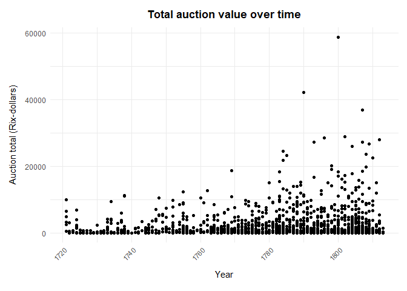

``` r
# plotting all goods
household_items <- c("beds", "chairs", "china", "clocks", "coatrack", "cups", "irons", "lamps", "tables", "balance")
household_items <- paste0("total_", household_items)
kitchen_items <- c("oven", "plates", "pot", "utensils")
kitchen_items <- paste0("total_", kitchen_items)
farming_items <- c("cattle", "sheep", "plough", "wagons", "horses", "horse_cart", "guns", "hammers")
farming_items <- paste0("total_", farming_items)
select_items <- c("books", "slaves", "art_products")
select_items <- paste0("total_", select_items)

# household goods

all_goods_household <- trial_plots %>% 
    select(mooc_id, year, time_period, household_items) %>% 
    group_by(time_period) %>% 
    summarise(total_beds=mean(total_beds), 
              total_chairs=mean(total_chairs), 
              total_china=mean(total_china), 
              total_clocks=mean(total_clocks), 
              total_coatrack=mean(total_coatrack), 
              total_cups=mean(total_cups), 
              total_irons=mean(total_irons), 
              total_lamps=mean(total_lamps), 
              total_tables=mean(total_tables), 
              total_balance=mean(total_balance)) %>% 
        gather(household_goods, value, household_items) %>% 
    ungroup()
```

    ## Warning: Using an external vector in selections was deprecated in tidyselect 1.1.0.
    ## ℹ Please use `all_of()` or `any_of()` instead.
    ##   # Was:
    ##   data %>% select(household_items)
    ## 
    ##   # Now:
    ##   data %>% select(all_of(household_items))
    ## 
    ## See <https://tidyselect.r-lib.org/reference/faq-external-vector.html>.
    ## This warning is displayed once every 8 hours.
    ## Call `lifecycle::last_lifecycle_warnings()` to see where this warning was
    ## generated.

``` r
household_goods <- ggplot(all_goods_household, aes(x=time_period, y=value, fill= household_goods)) +
    geom_bar(stat="identity")+
    scale_fill_manual(values = c("#FFB400", "#FFC740", "#C20008", "#FF020D", "#13AFEF", "#009944", "#8C4799", "#FF6600", "#A6BDDB", "#00B33C"))+
     labs(title = "Number of houshold goods per auction over time",
       x = "Year", y = "Total number of household goods", 
       fill = "Household goods") +
  theme_minimal() +
  theme(plot.title = element_text(hjust = 0.5, vjust = 2, face="bold"),
        axis.title.y = element_text(margin = margin(r = 10)),
        axis.title.x = element_text(margin = margin(t = 10)),
        axis.text.x = element_text(angle = 45, hjust = 1, size = 8))
household_goods
```

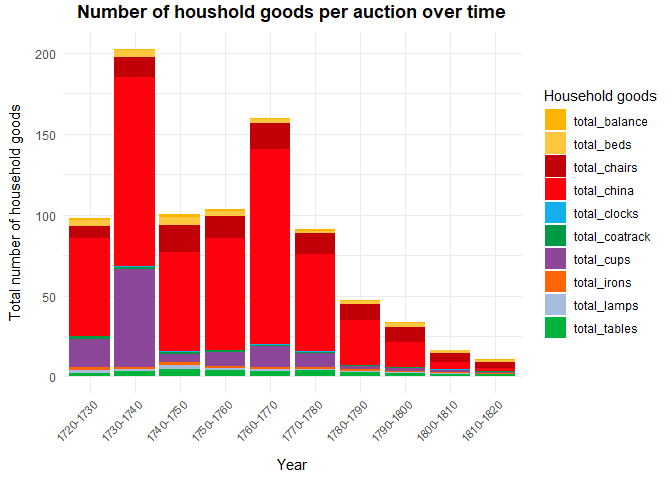

``` r
# kitchen items 

all_goods_kitchen <- trial_plots %>% 
    select(mooc_id, year, time_period, kitchen_items) %>% 
    group_by(time_period) %>% 
    summarise(total_oven=mean(total_oven), 
              total_plates=mean(total_plates), 
              total_pot=mean(total_pot), 
              total_utensils=mean(total_utensils)) %>% 
        gather(kitchen_goods, value, kitchen_items) %>% 
    ungroup()
```

    ## Warning: Using an external vector in selections was deprecated in tidyselect 1.1.0.
    ## ℹ Please use `all_of()` or `any_of()` instead.
    ##   # Was:
    ##   data %>% select(kitchen_items)
    ## 
    ##   # Now:
    ##   data %>% select(all_of(kitchen_items))
    ## 
    ## See <https://tidyselect.r-lib.org/reference/faq-external-vector.html>.
    ## This warning is displayed once every 8 hours.
    ## Call `lifecycle::last_lifecycle_warnings()` to see where this warning was
    ## generated.

``` r
kitchen_goods <- ggplot(all_goods_kitchen, aes(x=time_period, y=value, fill= kitchen_goods)) +
    geom_bar(stat="identity")+
    scale_fill_manual(values = c("#FFB400", "#FFC740", "#C20008", "#FF020D"))+
     labs(title = "Number of kitchen goods per auction over time",
       x = "Year", y = "Total number of kitchen goods", 
       fill = "Kitchen goods") +
  theme_minimal() +
  theme(plot.title = element_text(hjust = 0.5, vjust = 2, face="bold"),
        axis.title.y = element_text(margin = margin(r = 10)),
        axis.title.x = element_text(margin = margin(t = 10)),
        axis.text.x = element_text(angle = 45, hjust = 1, size = 8),
        plot.margin = margin(15, 10, 15, 10))

kitchen_goods
```

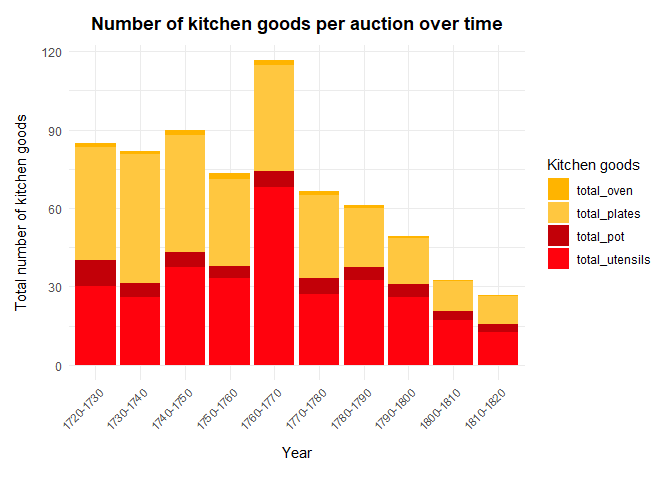

``` r
# farming items

all_goods_farm <- trial_plots %>% 
    select(mooc_id, year, time_period, farming_items) %>% 
    group_by(time_period) %>% 
    summarise(total_cattle=mean(total_cattle), 
              total_sheep=mean(total_sheep), 
              total_plough=mean(total_plough), 
              total_wagons=mean(total_wagons), 
              total_horses=mean(total_horses), 
              total_horse_cart=mean(total_horse_cart), 
              total_guns=mean(total_guns), 
              total_hammers=mean(total_hammers)) %>% 
        gather(farming_goods, value, farming_items) %>% 
    ungroup()
```

    ## Warning: Using an external vector in selections was deprecated in tidyselect 1.1.0.
    ## ℹ Please use `all_of()` or `any_of()` instead.
    ##   # Was:
    ##   data %>% select(farming_items)
    ## 
    ##   # Now:
    ##   data %>% select(all_of(farming_items))
    ## 
    ## See <https://tidyselect.r-lib.org/reference/faq-external-vector.html>.
    ## This warning is displayed once every 8 hours.
    ## Call `lifecycle::last_lifecycle_warnings()` to see where this warning was
    ## generated.

``` r
farming_goods <- ggplot(all_goods_farm, aes(x=time_period, y=value, fill= farming_goods)) +
    geom_bar(stat="identity")+
    scale_fill_manual(values = c("#FFB400", "#FFC740","#8C4799" , "#FF020D", "#13AFEF", "#009944","#C20008" , "#FF6600"))+ 
     labs(title = "Number of farming goods per auction over time",
       x = "Year", y = "Total number of farming goods", 
       fill = "Farming goods")+
  theme_minimal() +
  theme(plot.title = element_text(hjust = 0.5, vjust = 2, face="bold"),
        axis.title.y = element_text(margin = margin(r = 10)),
        axis.title.x = element_text(margin = margin(t = 10)),
        axis.text.x = element_text(angle = 45, hjust = 1, size = 8),
        plot.margin = margin(15, 10, 15, 10))

farming_goods
```

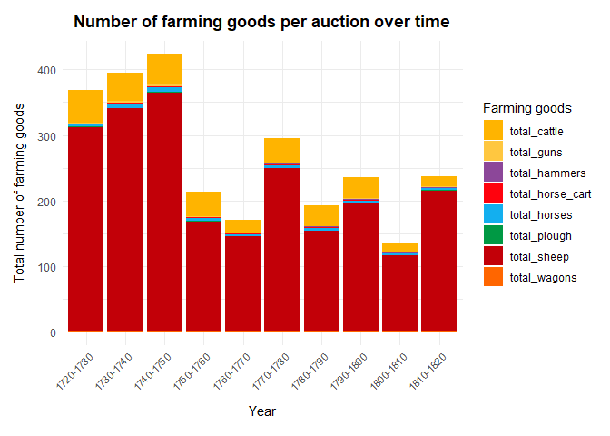

``` r
# select items

all_goods_select <- trial_plots %>% 
    select(mooc_id, year, time_period, select_items) %>% 
    group_by(time_period) %>% 
    summarise(total_books=mean(total_books),
              total_slaves=mean(total_slaves), 
              total_art_products=mean(total_art_products)) %>% 
        gather(select_goods, value, select_items) %>% 
    ungroup()
```

    ## Warning: Using an external vector in selections was deprecated in tidyselect 1.1.0.
    ## ℹ Please use `all_of()` or `any_of()` instead.
    ##   # Was:
    ##   data %>% select(select_items)
    ## 
    ##   # Now:
    ##   data %>% select(all_of(select_items))
    ## 
    ## See <https://tidyselect.r-lib.org/reference/faq-external-vector.html>.
    ## This warning is displayed once every 8 hours.
    ## Call `lifecycle::last_lifecycle_warnings()` to see where this warning was
    ## generated.

``` r
select_goods <- ggplot(all_goods_select, aes(x=time_period, y=value, fill= select_goods)) +
    geom_bar(stat="identity")+
    scale_fill_manual(values = c("#FFB400", "#C20008", "#FF020D"))+
     labs(title = "Number of select goods per auction over time",
       x = "Year", y = "Total number of select goods", 
       fill = "Select goods") +
  theme_minimal() +
  theme(plot.title = element_text(hjust = 0.5, vjust = 2, face="bold"),
        axis.title.y = element_text(margin = margin(r = 10)),
        axis.title.x = element_text(margin = margin(t = 10)),
        axis.text.x = element_text(angle = 45, hjust = 1, size = 8),
        plot.margin = margin(15, 10, 15, 10))

 select_goods
```

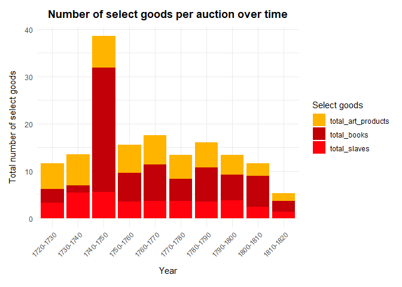

``` r
# focus on 5 most common goods and how bundle changes over time 

big_five_df <- model_df %>% 
  filter(year >= 1720) %>% 
  mutate(time_period = ifelse(year > 1720 & year < 1755, "1720-1755", 
                              ifelse(year >= 1755 & year < 1790, "1755-1790", 
                                     ifelse(year >= 1790 & year < 1820, "1790-1820", "NA"))))%>% filter(time_period!="NA") %>% 
    dplyr::select(time_period, total_cattle, total_sheep, total_horses, total_slaves, total_utensils) %>% 
    gather(good, value, total_cattle, total_sheep, total_horses, total_slaves, total_utensils) %>% 
    filter(value<200)
```

    ## Adding missing grouping variables: `year`

``` r
big_five_boxplots <- ggplot(big_five_df, aes(x = time_period, y = value, fill = good)) +
  geom_boxplot() +
  facet_wrap(~time_period, scales = "free_x") +
  labs(title = "Boxplots of the most frequently purchased goods by time period",
       x = "Time Period",
       y = "Number of purchases",
       fill = "Good type") +
  scale_fill_manual(values = c("#FFB400", "#FFC740", "#C20008", "#FF020D", "#13AFEF")) +
  theme(plot.title = element_text(hjust = 0.5, vjust = 2, face = "bold"),
        axis.title.y = element_text(margin = margin(r = 10)),
        axis.title.x = element_text(margin = margin(t = 10)),
        axis.text.x = element_blank(),
        plot.margin = margin(15, 10, 15, 10))

big_five_boxplots
```

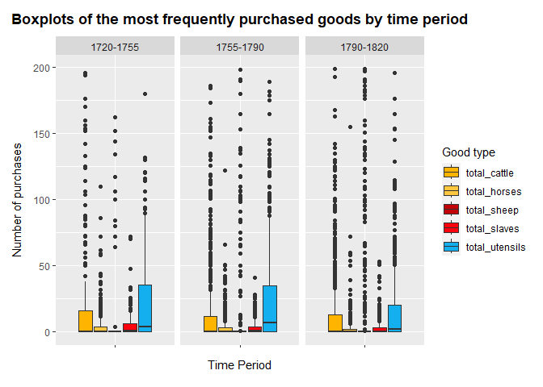

``` r
# attendance

library("remotes")
```

    ## Warning: package 'remotes' was built under R version 4.2.3

``` r
library("ggstream")
```

    ## Warning: package 'ggstream' was built under R version 4.2.3

``` r
library(ggplot2)

attendance_df <-  model_df %>% 
  filter(year >= 1720) %>% 
  mutate(time_period = ifelse(year > 1720 & year < 1730, "1720-1730", 
                              ifelse(year >= 1730 & year < 1740, "1730-1740", 
                                     ifelse(year >= 1740 & year < 1750, "1740-1750",
                                            ifelse(year >= 1750 & year < 1760, "1750-1760", 
                                                   ifelse(year >= 1760 & year < 1770, "1760-1770",
                                                          ifelse(year >= 1770 & year < 1780, "1770-1780",
                                                                 ifelse(year >= 1780 & year < 1790, "1780-1790",
                                                                        ifelse(year >= 1790 & year < 1800, "1790-1800", 
                                                                               ifelse(year >= 1800 & year < 1810, "1800-1810", 
                                                                                      ifelse(year >= 1810 & year < 1820, "1810-1820", NA))))))))))) %>% 
    filter(time_period!="NA") %>% 
    group_by(time_period) %>% 
    summarise(women=mean(women_tot), 
              men=mean(men_total)) %>% 
    gather(attendance, number, women, men)
attendance_df$number <- as.numeric(attendance_df$number)


attendance_plot <- ggplot(attendance_df, aes(x = time_period, y = number, fill = attendance)) +
  geom_bar(stat = "identity", position = "stack")+
      labs(title = "Average attendance by titled men and women over time",
       x = "Time Period",
       y = "Average attendance",
       fill = "Titled") +
  scale_fill_manual(values = c("#FFC740", "#C20008")) +
  theme(plot.title = element_text(hjust = 0.5, vjust = 2, face = "bold"),
        axis.title.y = element_text(margin = margin(r = 10)),
        axis.title.x = element_text(margin = margin(t = 10)),
        axis.text.x = element_text(angle = 45, hjust = 1, size = 8),
        plot.margin = margin(15, 10, 15, 10))
   
attendance_plot
```

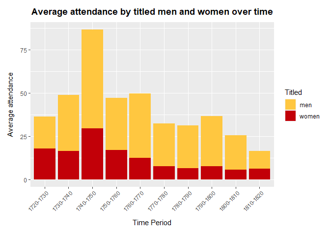

``` r
# bivariate analysis 

auction_size <- scatter_plotter(trial_plots$auction_size, "Auction values vs auction\n size","Auction size")
cattle <- scatter_plotter(trial_plots$total_cattle, "Auction values vs cattle\n purchases","Total number of cattle\n purhased per auction")
slaves <- scatter_plotter(trial_plots$total_slaves, "Auction values vs slave\n purchases","Total number of slaves\n purhased per auction")
sheep <- scatter_plotter(trial_plots$total_sheep, "Auction values vs sheep\n purchases","Total number of sheep\n purhased per auction")
horses <- scatter_plotter(trial_plots$total_horses, "Auction values vs horse\n purchases","Total number of horses\n purhased per auction")
men <- scatter_plotter(trial_plots$men_total, "Auction values vs titled\n men attendance","Total number of titled\n men per auction")

bivariat_plot <- grid.arrange(auction_size, cattle, slaves, sheep, horses, men, ncol = 3, nrow = 2)
```

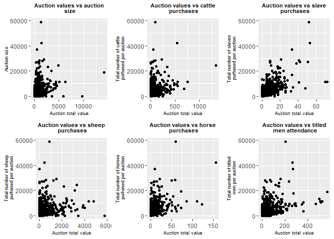

``` r
bivariat_plot
```

    ## TableGrob (2 x 3) "arrange": 6 grobs
    ##   z     cells    name           grob
    ## 1 1 (1-1,1-1) arrange gtable[layout]
    ## 2 2 (1-1,2-2) arrange gtable[layout]
    ## 3 3 (1-1,3-3) arrange gtable[layout]
    ## 4 4 (2-2,1-1) arrange gtable[layout]
    ## 5 5 (2-2,2-2) arrange gtable[layout]
    ## 6 6 (2-2,3-3) arrange gtable[layout]

feature and target transformations

``` r
auction_unlogged <- unlogged_distribution(model_df$auction_tot, "Distribution of total auction values", "Total auction value")
auction_logged <- model_df %>% mutate(auction_tot=log(auction_tot)) %>% 
     ggplot(aes(x=auction_tot))+
    geom_density()+
    labs(title = "Distribution of logged\n total auction values",
         x = "Logged total auction value", y = "Density") +
    theme(plot.title = element_text(hjust = 0.5, vjust = 2, face="bold"))
cattle_unlogged <- unlogged_distribution(model_df$total_cattle, "Distribution of number\n of cattle purchases", "Total cattle purchases per auction")
cattle_logged <- model_df %>% mutate(cattle=log(total_cattle)) %>% 
     ggplot(aes(x=cattle))+
    geom_density()+
    labs(title = "Distribution of logged\n cattle purchases",
         x = "Logged cattle purchases per auction", y = "Density") +
    theme(plot.title = element_text(hjust = 0.5, vjust = 2, face="bold"))
men_attend_unlogged <- unlogged_distribution(model_df$men_total, "Distribution of titled\n men auction attendance", "Titled men attendance\n per auction")
men_attend_logged <- model_df %>% mutate(men_total=log(men_total)) %>% 
     ggplot(aes(x=men_total))+
    geom_density()+
    labs(title = "Distribution of logged\n titled men attendance",
         x = "Logged titled men\n attendance per auction", y = "Density") +
    theme(plot.title = element_text(hjust = 0.5, vjust = 2, face="bold"))

distribution_plots <- grid.arrange(auction_unlogged, auction_logged, cattle_unlogged, cattle_logged, men_attend_unlogged, men_attend_logged, ncol = 2, nrow = 3)
```

    ## Warning: Removed 946 rows containing non-finite values (`stat_density()`).

    ## Warning: Removed 273 rows containing non-finite values (`stat_density()`).

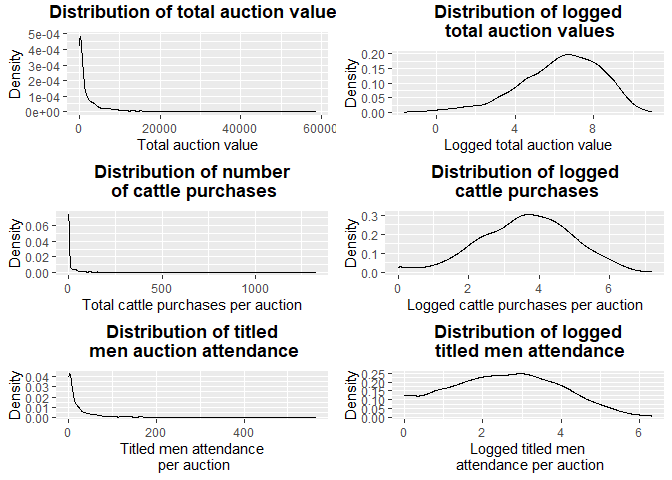

``` r
distribution_plots
```

    ## TableGrob (3 x 2) "arrange": 6 grobs
    ##   z     cells    name           grob
    ## 1 1 (1-1,1-1) arrange gtable[layout]
    ## 2 2 (1-1,2-2) arrange gtable[layout]
    ## 3 3 (2-2,1-1) arrange gtable[layout]
    ## 4 4 (2-2,2-2) arrange gtable[layout]
    ## 5 5 (3-3,1-1) arrange gtable[layout]
    ## 6 6 (3-3,2-2) arrange gtable[layout]

# regression

``` r
reg <- lm(auction_tot ~ ., data = ml_df)
summary(reg)
```

    ## 
    ## Call:
    ## lm(formula = auction_tot ~ ., data = ml_df)
    ## 
    ## Residuals:
    ##     Min      1Q  Median      3Q     Max 
    ## -6.5948 -0.5293  0.0539  0.6001  4.1455 
    ## 
    ## Coefficients:
    ##                     Estimate Std. Error t value Pr(>|t|)    
    ## (Intercept)        -0.313766   0.258401  -1.214 0.224846    
    ## total_beds          0.030920   0.051578   0.599 0.548949    
    ## total_books         0.015259   0.031399   0.486 0.627072    
    ## total_chairs        0.261487   0.050099   5.219 2.05e-07 ***
    ## total_china        -0.141661   0.030891  -4.586 4.91e-06 ***
    ## total_irons        -0.038633   0.080620  -0.479 0.631865    
    ## total_jewlery      -0.103175   0.084421  -1.222 0.221852    
    ## total_utensils      0.047291   0.029330   1.612 0.107102    
    ## total_art_products -0.033569   0.039911  -0.841 0.400440    
    ## total_balance      -0.117334   0.081773  -1.435 0.151540    
    ## total_clocks        0.035921   0.161785   0.222 0.824322    
    ## total_coatrack     -0.051524   0.084728  -0.608 0.543211    
    ## total_guns          0.131654   0.057684   2.282 0.022615 *  
    ## total_lamps        -0.102747   0.088199  -1.165 0.244232    
    ## total_oven          0.118811   0.066142   1.796 0.072653 .  
    ## total_plates        0.010087   0.040727   0.248 0.804424    
    ## total_pot          -0.143148   0.052739  -2.714 0.006721 ** 
    ## total_tables        0.027901   0.071554   0.390 0.696644    
    ## total_slaves        0.841320   0.046059  18.266  < 2e-16 ***
    ## total_cattle        0.118041   0.031233   3.779 0.000164 ***
    ## total_hammers       0.002032   0.070919   0.029 0.977149    
    ## total_horse_cart    0.061872   0.054133   1.143 0.253238    
    ## total_horses        0.026942   0.046512   0.579 0.562515    
    ## total_plough       -0.723920   0.107709  -6.721 2.58e-11 ***
    ## total_sheep         0.014712   0.024532   0.600 0.548800    
    ## total_wagons        0.108481   0.101793   1.066 0.286739    
    ## total_cups         -0.052726   0.035224  -1.497 0.134640    
    ## date                1.056096   0.057965  18.219  < 2e-16 ***
    ## auction_size        0.249047   0.033901   7.346 3.39e-13 ***
    ## women_tot           0.007093   0.033654   0.211 0.833102    
    ## men_total           0.205969   0.033692   6.113 1.25e-09 ***
    ## ---
    ## Signif. codes:  0 '***' 0.001 '**' 0.01 '*' 0.05 '.' 0.1 ' ' 1
    ## 
    ## Residual standard error: 1.138 on 1452 degrees of freedom
    ## Multiple R-squared:  0.705,  Adjusted R-squared:  0.6989 
    ## F-statistic: 115.7 on 30 and 1452 DF,  p-value: < 2.2e-16

``` r
# comparison
residuals <- reg$residuals
rmse <- sqrt(mean(residuals^2)) # 1.13
r_squared <- summary(reg)$r.squared # 0.71
```

# splitting into testing and training

``` r
# testing and training 
set.seed(123)
indices <- sample(nrow(ml_df))
train_size <- floor(0.6 * nrow(ml_df))
training_data <- ml_df[indices[1:train_size], ]
testing_data <- ml_df[indices[(train_size + 1):nrow(ml_df)], ]
```

# knn method

``` r
sampling_strat <- caret::trainControl(
    method="repeatedcv", 
    number=10, 
    repeats=5
)

hyper_grid <- expand.grid(k = seq(1, 25, by = 1))

knn_fit <- train(
  auction_tot ~ ., 
  data = training_data, 
  method = "knn", 
  trControl = sampling_strat, 
  tuneGrid = hyper_grid,
  metric = "RMSE"
)


knn_plot <- ggplot(knn_fit)+
    labs(title= "Optimal k-value", 
         x="Neighbours")+
    theme(plot.title = element_text(hjust = 0.5, vjust = 2, face = "bold"),
        axis.text.x = element_text(angle = 45, hjust = 1, size = 8))
knn_plot
```

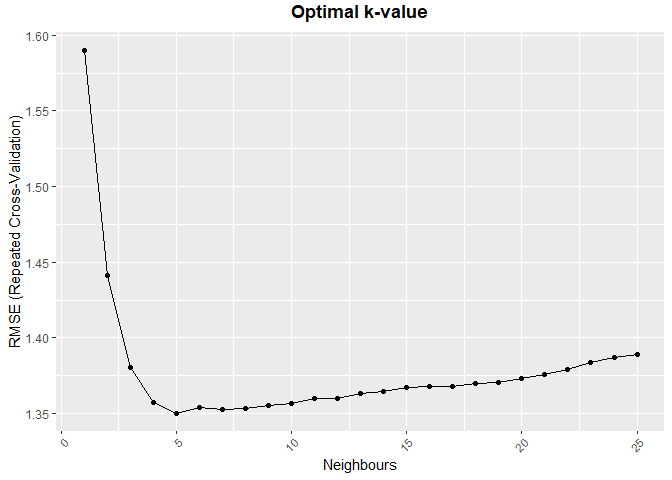

``` r
# k = 5 has the lowest RMSE
#  k=5 RMSE = 1.345573  Rsquared = 0.5987131 MAE = 0.9381762  

library(caret)

# Train the KNN model with the chosen k value
k <- 5
knn_model <- train(
  auction_tot ~ .,
  data = training_data,
  method = "knn",
  trControl = sampling_strat,
  tuneGrid = data.frame(k = k),
  metric = "RMSE"
)


# Make predictions on the testing data
predictions_knn <- predict(knn_model, newdata = testing_data)
RMSE(predictions_knn, testing_data$auction_tot) # 1.17
```

    ## [1] 1.172112

``` r
MAE(predictions_knn, testing_data$auction_tot) # 0.83
```

    ## [1] 0.836182

``` r
R2(predictions_knn, testing_data$auction_tot) # r-squared: 0.66
```

    ## [1] 0.6603818

``` r
# plot
prediction_knn_df <- data.frame(
  Actual = testing_data$auction_tot,
  Predicted = predictions_knn
) 
prediction_knn_df <- prediction_knn_df %>% 
    mutate(accuracy= ifelse(abs(Predicted-Actual)<0.1, "Within 0.1 of predicted value", 
                            ifelse(abs(Predicted-Actual)<0.2, "Within 0.2 of predicted value", 
                                   ifelse(abs(Predicted-Actual)<0.3, "Within 0.3 of predicted value", 
                                          "More than 0.3 from predicted value"))))

knn_predictions_plot <- ggplot(prediction_knn_df, aes(x = Actual, y = Predicted, colour=accuracy)) +
  geom_point() +
    geom_abline(intercept = 0, slope = 1, linetype = "dashed", color = "black") +
  labs(title = "knn model: predictions vs actual values", x = "Actual", y = "Predicted")+
    theme(plot.title = element_text(hjust = 0.5, vjust = 2, face = "bold"),
        axis.text.x = element_text(angle = 45, hjust = 1, size = 8))

knn_predictions_plot
```

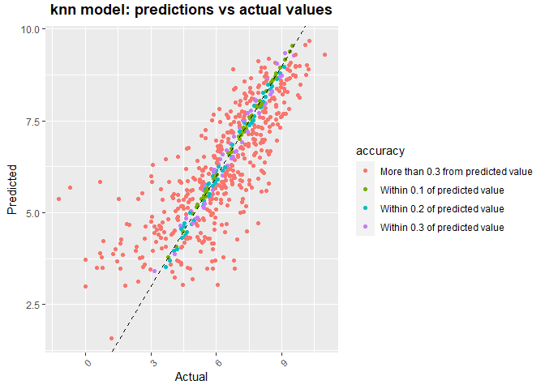

# random forest

``` r
dim(ml_df)
```

    ## [1] 1483   31

``` r
n_features <- length(setdiff(names(training_data), "auction_tot"))


# train a default random forest model
training_rf <- ranger(
  auction_tot ~ ., 
  data = training_data,
  mtry = floor(n_features / 3),
  respect.unordered.factors = "order",
  importance= "permutation",
  seed = 123
)
training_rf
```

    ## Ranger result
    ## 
    ## Call:
    ##  ranger(auction_tot ~ ., data = training_data, mtry = floor(n_features/3),      respect.unordered.factors = "order", importance = "permutation",      seed = 123) 
    ## 
    ## Type:                             Regression 
    ## Number of trees:                  500 
    ## Sample size:                      889 
    ## Number of independent variables:  30 
    ## Mtry:                             10 
    ## Target node size:                 5 
    ## Variable importance mode:         permutation 
    ## Splitrule:                        variance 
    ## OOB prediction error (MSE):       1.201175 
    ## R squared (OOB):                  0.7317454

``` r
default_rmse <- sqrt(training_rf$prediction.error) # RMSE: 1.1
rf_importance <- ranger::importance(training_rf)
sort(rf_importance, decreasing = TRUE)
```

    ##       total_slaves       auction_size               date          men_total 
    ##       2.0709986939       1.1675256521       0.8769795417       0.5941417931 
    ##       total_chairs       total_plates     total_utensils          total_pot 
    ##       0.5820742967       0.4190024827       0.2884131821       0.2372129686 
    ##        total_china      total_balance         total_beds       total_cattle 
    ##       0.1551568313       0.1440438703       0.1317438275       0.1278095933 
    ##          women_tot        total_sheep         total_guns       total_tables 
    ##       0.1099365076       0.1087080797       0.0815461205       0.0800542503 
    ##       total_horses       total_plough   total_horse_cart        total_lamps 
    ##       0.0729479193       0.0717635415       0.0594090271       0.0499657630 
    ##     total_coatrack        total_books       total_wagons total_art_products 
    ##       0.0409177238       0.0399103094       0.0361094745       0.0193542969 
    ##         total_cups         total_oven        total_irons      total_jewlery 
    ##       0.0151104075       0.0140819272       0.0070677599       0.0046132689 
    ##       total_clocks      total_hammers 
    ##       0.0002587413       0.0001944009

``` r
# parameter grid
#parameter_grid <- expand.grid(
#  mtry = c(floor(n_features / 3)),
#  num.trees = c(100, 300, 500),
#  min.node.size = c(1, 5, 10)
#)

#results <- lapply(1:nrow(parameter_grid), function(i) {
#  model <- ranger(
#    auction_tot ~ .,
#    data = training_data,
#    num.trees = parameter_grid$num.trees[i],
#    mtry = parameter_grid$mtry[i],
#    min.node.size = parameter_grid$min.node.size[i],
#   respect.unordered.factors = "order",
#   importance = "permutation",
#    seed = 123
#  )
#  predictions <- predict(model, data = testing_data)$predictions
#  rmse <- sqrt(mean((predictions - testing_data$auction_tot)^2))
#  list(model = model, rmse = rmse)
#})

#best_model_index <- which.min(sapply(results, function(x) x$rmse))
#best_model <- results[[best_model_index]]$model

#train_predictions <- predict(best_model, data = training_data)$predictions
#rmse_train <- sqrt(mean((train_predictions - training_data$auction_tot)^2)) # RMSE: 0.68

# baseline model is the best
default_predictions <- predict(training_rf, data = testing_data)$predictions
rmse_default_test <- sqrt(mean((default_predictions - training_data$auction_tot)^2)) # 2.68
```

    ## Warning in default_predictions - training_data$auction_tot: longer object
    ## length is not a multiple of shorter object length

``` r
# plot
rf_predictions <- data.frame(
  Actual = testing_data$auction_tot,
  Predictions = default_predictions
) %>% 
    mutate(Accuracy= ifelse(abs(Predictions-Actual)<0.1, "Within 0.1 of predicted value", 
                            ifelse(abs(Predictions-Actual)<0.2, "Within 0.2 of predicted value", 
                                   ifelse(abs(Predictions-Actual)<0.3, "Within 0.3 of predicted value", 
                                          "More than 0.3 from predicted value"))))

rf_plot <- ggplot(rf_predictions, aes(x = Actual, y = Predictions, color = Accuracy)) +
  geom_point() +
    geom_abline(intercept = 0, slope = 1, linetype = "dashed") +
  labs(title = "Random forest: predictions vs actual values", x = "Actual", y = "Predicted")+
    theme(plot.title = element_text(hjust = 0.5, vjust = 2, face = "bold"),
        axis.text.x = element_text(angle = 45, hjust = 1, size = 8))
    

rf_predictions
```

    ## Warning in knit_print.huxtable(ht): Unrecognized output format "markdown". Using `to_screen` to print huxtables.
    ## Set options("huxtable.knitr_output_format") manually to "latex", "html", "rtf", "docx", "pptx", "md" or "screen".

               ┌────────────────────────────────────────────────┐
               │ Actual   Predictions   Accuracy                │
               ├────────────────────────────────────────────────┤
               │  7.23           7.33   Within 0.1 of predicted │
               │                        value                   │
               │  3.87           3.8    Within 0.1 of predicted │
               │                        value                   │
               │  7.62           7.71   Within 0.1 of predicted │
               │                        value                   │
               │  3.28           4.17   More than 0.3 from      │
               │                        predicted value         │
               │  6.18           6.33   Within 0.2 of predicted │
               │                        value                   │
               │  8.13           7.43   More than 0.3 from      │
               │                        predicted value         │
               │  9.15           9.27   Within 0.2 of predicted │
               │                        value                   │
               │  3.1            4.18   More than 0.3 from      │
               │                        predicted value         │
               │  6.35           5.51   More than 0.3 from      │
               │                        predicted value         │
               │  5.41           4.48   More than 0.3 from      │
               │                        predicted value         │
               │  8.13           8.09   Within 0.1 of predicted │
               │                        value                   │
               │  8.92           8.71   Within 0.3 of predicted │
               │                        value                   │
               │  4.01           4.64   More than 0.3 from      │
               │                        predicted value         │
               │  4.38           3.91   More than 0.3 from      │
               │                        predicted value         │
               │  5.07           5.1    Within 0.1 of predicted │
               │                        value                   │
               │  5.4            5.14   Within 0.3 of predicted │
               │                        value                   │
               │  6.88           6.88   Within 0.1 of predicted │
               │                        value                   │
               │  6.85           6.18   More than 0.3 from      │
               │                        predicted value         │
               │  6.54           7.05   More than 0.3 from      │
               │                        predicted value         │
               │  8.15           7.9    Within 0.3 of predicted │
               │                        value                   │
               │  7.46           7.44   Within 0.1 of predicted │
               │                        value                   │
               │  8.56           8.48   Within 0.1 of predicted │
               │                        value                   │
               │  3.4            4.82   More than 0.3 from      │
               │                        predicted value         │
               │  4.52           5.27   More than 0.3 from      │
               │                        predicted value         │
               │  7.72           7.28   More than 0.3 from      │
               │                        predicted value         │
               │  8.77           7.88   More than 0.3 from      │
               │                        predicted value         │
               │  7.53           8.15   More than 0.3 from      │
               │                        predicted value         │
               │  6.9            7.17   Within 0.3 of predicted │
               │                        value                   │
               │  8.67           7.95   More than 0.3 from      │
               │                        predicted value         │
               │  7.5            8.03   More than 0.3 from      │
               │                        predicted value         │
               │  6.78           6.9    Within 0.2 of predicted │
               │                        value                   │
               │  5.38           5.89   More than 0.3 from      │
               │                        predicted value         │
               │  7.17           6.11   More than 0.3 from      │
               │                        predicted value         │
               │  4.68           3.76   More than 0.3 from      │
               │                        predicted value         │
               │  5.43           5.16   Within 0.3 of predicted │
               │                        value                   │
               │  9.34           8.92   More than 0.3 from      │
               │                        predicted value         │
               │  5.43           5.2    Within 0.3 of predicted │
               │                        value                   │
               │  6.11           6.67   More than 0.3 from      │
               │                        predicted value         │
               │  5.24           5.18   Within 0.1 of predicted │
               │                        value                   │
               │  5.9            4.49   More than 0.3 from      │
               │                        predicted value         │
               │ 10.2            9.39   More than 0.3 from      │
               │                        predicted value         │
               │  6.83           3.69   More than 0.3 from      │
               │                        predicted value         │
               │  3.95           4.13   Within 0.2 of predicted │
               │                        value                   │
               │  5.7            3.85   More than 0.3 from      │
               │                        predicted value         │
               │  7.79           5.54   More than 0.3 from      │
               │                        predicted value         │
               │  4.62           4.69   Within 0.1 of predicted │
               │                        value                   │
               │  3.01           4.97   More than 0.3 from      │
               │                        predicted value         │
               │  8.27           8.68   More than 0.3 from      │
               │                        predicted value         │
               │  8.75           8.46   Within 0.3 of predicted │
               │                        value                   │
               │  7.31           6.73   More than 0.3 from      │
               │                        predicted value         │
               │  7.91           8.19   Within 0.3 of predicted │
               │                        value                   │
               │  6.44           6.29   Within 0.2 of predicted │
               │                        value                   │
               │  6.68           6.95   Within 0.3 of predicted │
               │                        value                   │
               │  6.27           4.49   More than 0.3 from      │
               │                        predicted value         │
               │  7.07           7.68   More than 0.3 from      │
               │                        predicted value         │
               │  8.96           6.85   More than 0.3 from      │
               │                        predicted value         │
               │  7.34           7.03   More than 0.3 from      │
               │                        predicted value         │
               │  4.88           4.93   Within 0.1 of predicted │
               │                        value                   │
               │  5.82           4.97   More than 0.3 from      │
               │                        predicted value         │
               │  5.39           5.05   More than 0.3 from      │
               │                        predicted value         │
               │  7.04           7.1    Within 0.1 of predicted │
               │                        value                   │
               │  8.39           7.92   More than 0.3 from      │
               │                        predicted value         │
               │  3.36           4.02   More than 0.3 from      │
               │                        predicted value         │
               │  8.73           9.04   More than 0.3 from      │
               │                        predicted value         │
               │  6.82           3.79   More than 0.3 from      │
               │                        predicted value         │
               │  7.69           7.13   More than 0.3 from      │
               │                        predicted value         │
               │  6.4            7.1    More than 0.3 from      │
               │                        predicted value         │
               │  5.99           6.34   More than 0.3 from      │
               │                        predicted value         │
               │  6.79           6.78   Within 0.1 of predicted │
               │                        value                   │
               │  8.34           6.37   More than 0.3 from      │
               │                        predicted value         │
               │  4.55           3.88   More than 0.3 from      │
               │                        predicted value         │
               │  5.74           5.48   Within 0.3 of predicted │
               │                        value                   │
               │  6.31           5.87   More than 0.3 from      │
               │                        predicted value         │
               │  5.63           3.72   More than 0.3 from      │
               │                        predicted value         │
               │  0.693          4.57   More than 0.3 from      │
               │                        predicted value         │
               │  5.45           5.54   Within 0.1 of predicted │
               │                        value                   │
               │  8.87           8.81   Within 0.1 of predicted │
               │                        value                   │
               │  7.15           6.03   More than 0.3 from      │
               │                        predicted value         │
               │  6.25           6.7    More than 0.3 from      │
               │                        predicted value         │
               │  8.26           7.52   More than 0.3 from      │
               │                        predicted value         │
               │  4.07           4.04   Within 0.1 of predicted │
               │                        value                   │
               │  6.1            6.45   More than 0.3 from      │
               │                        predicted value         │
               │  5.37           4.53   More than 0.3 from      │
               │                        predicted value         │
               │  5.81           5.54   Within 0.3 of predicted │
               │                        value                   │
               │  7.28           7.39   Within 0.2 of predicted │
               │                        value                   │
               │  2.43           3.85   More than 0.3 from      │
               │                        predicted value         │
               │  5.45           5.51   Within 0.1 of predicted │
               │                        value                   │
               │  5.95           5.31   More than 0.3 from      │
               │                        predicted value         │
               │  6.55           6.46   Within 0.1 of predicted │
               │                        value                   │
               │  8              8      Within 0.1 of predicted │
               │                        value                   │
               │  4.48           3.61   More than 0.3 from      │
               │                        predicted value         │
               │  6.44           6.16   Within 0.3 of predicted │
               │                        value                   │
               │  5.66           6.05   More than 0.3 from      │
               │                        predicted value         │
               │  8.53           8.38   Within 0.2 of predicted │
               │                        value                   │
               │  5.04           5.06   Within 0.1 of predicted │
               │                        value                   │
               │  8.79           8.54   Within 0.3 of predicted │
               │                        value                   │
               │  6.17           5.27   More than 0.3 from      │
               │                        predicted value         │
               │  9.06           8.53   More than 0.3 from      │
               │                        predicted value         │
               │  6.72           7.2    More than 0.3 from      │
               │                        predicted value         │
               │  5.51           6.71   More than 0.3 from      │
               │                        predicted value         │
               │  3.69           3.93   Within 0.3 of predicted │
               │                        value                   │
               │  6.26           5.35   More than 0.3 from      │
               │                        predicted value         │
               │  9.39           8.83   More than 0.3 from      │
               │                        predicted value         │
               │  6.2            5.13   More than 0.3 from      │
               │                        predicted value         │
               │  8.61           8.8    Within 0.2 of predicted │
               │                        value                   │
               │  2.5            4.18   More than 0.3 from      │
               │                        predicted value         │
               │  7.75           6.78   More than 0.3 from      │
               │                        predicted value         │
               │  7.31           8.1    More than 0.3 from      │
               │                        predicted value         │
               │  4.69           5.06   More than 0.3 from      │
               │                        predicted value         │
               │  6.33           4.63   More than 0.3 from      │
               │                        predicted value         │
               │ 10.2            9.15   More than 0.3 from      │
               │                        predicted value         │
               │  3.15           4.98   More than 0.3 from      │
               │                        predicted value         │
               │  6.71           6.17   More than 0.3 from      │
               │                        predicted value         │
               │  5.72           5.5    Within 0.3 of predicted │
               │                        value                   │
               │  6.11           6.35   Within 0.3 of predicted │
               │                        value                   │
               │  8.84           8.38   More than 0.3 from      │
               │                        predicted value         │
               │  4.26           4.8    More than 0.3 from      │
               │                        predicted value         │
               │  7.07           7.14   Within 0.1 of predicted │
               │                        value                   │
               │  8.34           8.14   Within 0.2 of predicted │
               │                        value                   │
               │  7.51           6.2    More than 0.3 from      │
               │                        predicted value         │
               │  1.19           1.54   More than 0.3 from      │
               │                        predicted value         │
               │  8.41           7.47   More than 0.3 from      │
               │                        predicted value         │
               │  8.42           8.76   More than 0.3 from      │
               │                        predicted value         │
               │  7.16           7.38   Within 0.3 of predicted │
               │                        value                   │
               │  8.27           8.46   Within 0.2 of predicted │
               │                        value                   │
               │  6.49           6.94   More than 0.3 from      │
               │                        predicted value         │
               │  8.48           7.8    More than 0.3 from      │
               │                        predicted value         │
               │  2.71           3.85   More than 0.3 from      │
               │                        predicted value         │
               │  6.7            6.28   More than 0.3 from      │
               │                        predicted value         │
               │  5.44           4.46   More than 0.3 from      │
               │                        predicted value         │
               │  9.76           8.86   More than 0.3 from      │
               │                        predicted value         │
               │  9.06           8.36   More than 0.3 from      │
               │                        predicted value         │
               │  6.21           6.82   More than 0.3 from      │
               │                        predicted value         │
               │  7.49           6.89   More than 0.3 from      │
               │                        predicted value         │
               │  7.74           7.05   More than 0.3 from      │
               │                        predicted value         │
               │  9.58           9.34   Within 0.3 of predicted │
               │                        value                   │
               │  7.91           7.01   More than 0.3 from      │
               │                        predicted value         │
               │  7.57           6.93   More than 0.3 from      │
               │                        predicted value         │
               │  9.12           8.91   Within 0.3 of predicted │
               │                        value                   │
               │  7.03           6.99   Within 0.1 of predicted │
               │                        value                   │
               │  6.83           6.64   Within 0.2 of predicted │
               │                        value                   │
               │  4.9            2.96   More than 0.3 from      │
               │                        predicted value         │
               │  7.17           7.86   More than 0.3 from      │
               │                        predicted value         │
               │  5.43           4.84   More than 0.3 from      │
               │                        predicted value         │
               │  7.12           7.93   More than 0.3 from      │
               │                        predicted value         │
               │  4.29           3.91   More than 0.3 from      │
               │                        predicted value         │
               │  6.28           7.26   More than 0.3 from      │
               │                        predicted value         │
               │  5.3            3.85   More than 0.3 from      │
               │                        predicted value         │
               │  3.8            3.98   Within 0.2 of predicted │
               │                        value                   │
               │  4.51           5.11   More than 0.3 from      │
               │                        predicted value         │
               │  5.19           5.48   Within 0.3 of predicted │
               │                        value                   │
               │  6.86           6.69   Within 0.2 of predicted │
               │                        value                   │
               │  4.9            4.7    Within 0.2 of predicted │
               │                        value                   │
               │  8.48           7.98   More than 0.3 from      │
               │                        predicted value         │
               │  7.79           7.17   More than 0.3 from      │
               │                        predicted value         │
               │  3.45           4.5    More than 0.3 from      │
               │                        predicted value         │
               │  5.85           5.27   More than 0.3 from      │
               │                        predicted value         │
               │  6.53           6.48   Within 0.1 of predicted │
               │                        value                   │
               │  7.07           7.32   Within 0.3 of predicted │
               │                        value                   │
               │  3.16           3.65   More than 0.3 from      │
               │                        predicted value         │
               │  7.92           7.78   Within 0.2 of predicted │
               │                        value                   │
               │  6.39           5.4    More than 0.3 from      │
               │                        predicted value         │
               │  9              8.17   More than 0.3 from      │
               │                        predicted value         │
               │  5.22           4.63   More than 0.3 from      │
               │                        predicted value         │
               │  5.6            3.8    More than 0.3 from      │
               │                        predicted value         │
               │  5.35           5.78   More than 0.3 from      │
               │                        predicted value         │
               │  4.99           4.45   More than 0.3 from      │
               │                        predicted value         │
               │  8.35           7.66   More than 0.3 from      │
               │                        predicted value         │
               │  6.55           6.94   More than 0.3 from      │
               │                        predicted value         │
               │  9.84           8.62   More than 0.3 from      │
               │                        predicted value         │
               │  7.22           6.9    More than 0.3 from      │
               │                        predicted value         │
               │  8.23           7.83   More than 0.3 from      │
               │                        predicted value         │
               │  5.89           5.91   Within 0.1 of predicted │
               │                        value                   │
               │  5.28           5.07   Within 0.3 of predicted │
               │                        value                   │
               │  5.92           5.76   Within 0.2 of predicted │
               │                        value                   │
               │ 10.3            9.6    More than 0.3 from      │
               │                        predicted value         │
               │  7.08           7.05   Within 0.1 of predicted │
               │                        value                   │
               │  4.44           4.11   More than 0.3 from      │
               │                        predicted value         │
               │  4.9            5.28   More than 0.3 from      │
               │                        predicted value         │
               │  5.91           5.26   More than 0.3 from      │
               │                        predicted value         │
               │  5.27           4.89   More than 0.3 from      │
               │                        predicted value         │
               │  2.34           4.2    More than 0.3 from      │
               │                        predicted value         │
               │  7              5.73   More than 0.3 from      │
               │                        predicted value         │
               │  6.07           6.09   Within 0.1 of predicted │
               │                        value                   │
               │  6.57           6.65   Within 0.1 of predicted │
               │                        value                   │
               │  5.46           3.86   More than 0.3 from      │
               │                        predicted value         │
               │  1.61           3.69   More than 0.3 from      │
               │                        predicted value         │
               │  5.5            5.72   Within 0.3 of predicted │
               │                        value                   │
               │  4.68           5.78   More than 0.3 from      │
               │                        predicted value         │
               │  7.62           7.84   Within 0.3 of predicted │
               │                        value                   │
               │  6.54           6.75   Within 0.3 of predicted │
               │                        value                   │
               │  1.82           2.54   More than 0.3 from      │
               │                        predicted value         │
               │  5.94           3.8    More than 0.3 from      │
               │                        predicted value         │
               │  2.71           3.9    More than 0.3 from      │
               │                        predicted value         │
               │  5.54           5.64   Within 0.2 of predicted │
               │                        value                   │
               │  9.64           9.45   Within 0.2 of predicted │
               │                        value                   │
               │  8.18           8.05   Within 0.2 of predicted │
               │                        value                   │
               │  4.09           4.76   More than 0.3 from      │
               │                        predicted value         │
               │  3.62           4.49   More than 0.3 from      │
               │                        predicted value         │
               │  7.94           5.01   More than 0.3 from      │
               │                        predicted value         │
               │  5.75           5.77   Within 0.1 of predicted │
               │                        value                   │
               │  9.43           8.85   More than 0.3 from      │
               │                        predicted value         │
               │  5.15           4.65   More than 0.3 from      │
               │                        predicted value         │
               │  8.15           7.61   More than 0.3 from      │
               │                        predicted value         │
               │  4.63           5.62   More than 0.3 from      │
               │                        predicted value         │
               │  7.45           7.94   More than 0.3 from      │
               │                        predicted value         │
               │  6.17           6.46   Within 0.3 of predicted │
               │                        value                   │
               │  4.58           5.15   More than 0.3 from      │
               │                        predicted value         │
               │  5.36           5.16   Within 0.3 of predicted │
               │                        value                   │
               │  3.98           3.93   Within 0.1 of predicted │
               │                        value                   │
               │  7.68           7.11   More than 0.3 from      │
               │                        predicted value         │
               │  5.94           5.42   More than 0.3 from      │
               │                        predicted value         │
               │  8.17           8.04   Within 0.2 of predicted │
               │                        value                   │
               │  0              2.32   More than 0.3 from      │
               │                        predicted value         │
               │  7.79           7.28   More than 0.3 from      │
               │                        predicted value         │
               │  3.47           4.11   More than 0.3 from      │
               │                        predicted value         │
               │  4.57           4.14   More than 0.3 from      │
               │                        predicted value         │
               │ 10.1            9.23   More than 0.3 from      │
               │                        predicted value         │
               │  7.06           7.49   More than 0.3 from      │
               │                        predicted value         │
               │  6.72           6.2    More than 0.3 from      │
               │                        predicted value         │
               │  9.63           9.28   More than 0.3 from      │
               │                        predicted value         │
               │  6.06           6.25   Within 0.2 of predicted │
               │                        value                   │
               │  5.98           5.53   More than 0.3 from      │
               │                        predicted value         │
               │  8.74           8.37   More than 0.3 from      │
               │                        predicted value         │
               │  6.64           6.73   Within 0.1 of predicted │
               │                        value                   │
               │  8.1            7.08   More than 0.3 from      │
               │                        predicted value         │
               │  3.51           4.44   More than 0.3 from      │
               │                        predicted value         │
               │  7.1            5.5    More than 0.3 from      │
               │                        predicted value         │
               │  7              6.33   More than 0.3 from      │
               │                        predicted value         │
               │  4.61           4.93   More than 0.3 from      │
               │                        predicted value         │
               │  6              4.01   More than 0.3 from      │
               │                        predicted value         │
               │  6.42           5.85   More than 0.3 from      │
               │                        predicted value         │
               │  4.24           6.23   More than 0.3 from      │
               │                        predicted value         │
               │  7.39           7.28   Within 0.2 of predicted │
               │                        value                   │
               │  9.36           9.49   Within 0.2 of predicted │
               │                        value                   │
               │  3.56           3.43   Within 0.2 of predicted │
               │                        value                   │
               │  3.48           4.77   More than 0.3 from      │
               │                        predicted value         │
               │  5.93           5.91   Within 0.1 of predicted │
               │                        value                   │
               │  5.86           5.17   More than 0.3 from      │
               │                        predicted value         │
               │  4.25           4.8    More than 0.3 from      │
               │                        predicted value         │
               │  5.57           5.83   Within 0.3 of predicted │
               │                        value                   │
               │  9.62           8.99   More than 0.3 from      │
               │                        predicted value         │
               │  9.3            8.73   More than 0.3 from      │
               │                        predicted value         │
               │  7.11           7.39   Within 0.3 of predicted │
               │                        value                   │
               │  8.73           8.41   More than 0.3 from      │
               │                        predicted value         │
               │  5.44           4.89   More than 0.3 from      │
               │                        predicted value         │
               │  7.26           7.34   Within 0.1 of predicted │
               │                        value                   │
               │  4.68           4.93   Within 0.3 of predicted │
               │                        value                   │
               │  4.81           3.8    More than 0.3 from      │
               │                        predicted value         │
               │  7.2            6.14   More than 0.3 from      │
               │                        predicted value         │
               │  1.39           3.83   More than 0.3 from      │
               │                        predicted value         │
               │  9.63           9.37   Within 0.3 of predicted │
               │                        value                   │
               │  7.61           7.85   Within 0.3 of predicted │
               │                        value                   │
               │  7.2            7.09   Within 0.2 of predicted │
               │                        value                   │
               │  8.36           8.1    Within 0.3 of predicted │
               │                        value                   │
               │  3.16           4.35   More than 0.3 from      │
               │                        predicted value         │
               │  5.9            6.3    More than 0.3 from      │
               │                        predicted value         │
               │  4.17           4.57   More than 0.3 from      │
               │                        predicted value         │
               │  4.47           4.19   Within 0.3 of predicted │
               │                        value                   │
               │  8.26           6.79   More than 0.3 from      │
               │                        predicted value         │
               │  5.46           5.37   Within 0.1 of predicted │
               │                        value                   │
               │  8.25           8.16   Within 0.1 of predicted │
               │                        value                   │
               │  6.8            6.65   Within 0.2 of predicted │
               │                        value                   │
               │  7.95           8.23   Within 0.3 of predicted │
               │                        value                   │
               │  9.21           8.52   More than 0.3 from      │
               │                        predicted value         │
               │  6.32           6.49   Within 0.2 of predicted │
               │                        value                   │
               │  7.12           6.9    Within 0.3 of predicted │
               │                        value                   │
               │  8.59           8.06   More than 0.3 from      │
               │                        predicted value         │
               │  7.28           7.35   Within 0.1 of predicted │
               │                        value                   │
               │  6.82           5.51   More than 0.3 from      │
               │                        predicted value         │
               │  4.62           5.5    More than 0.3 from      │
               │                        predicted value         │
               │  6.76           6.18   More than 0.3 from      │
               │                        predicted value         │
               │  6.44           6.17   Within 0.3 of predicted │
               │                        value                   │
               │  7.24           5.45   More than 0.3 from      │
               │                        predicted value         │
               │  2.77           4.58   More than 0.3 from      │
               │                        predicted value         │
               │  4.22           3.79   More than 0.3 from      │
               │                        predicted value         │
               │  7.36           7.11   Within 0.3 of predicted │
               │                        value                   │
               │  4.65           4.23   More than 0.3 from      │
               │                        predicted value         │
               │  6.3            6.12   Within 0.2 of predicted │
               │                        value                   │
               │  6.11           5.73   More than 0.3 from      │
               │                        predicted value         │
               │  6.67           7.01   More than 0.3 from      │
               │                        predicted value         │
               │  4.1            3.61   More than 0.3 from      │
               │                        predicted value         │
               │  1.63           3.82   More than 0.3 from      │
               │                        predicted value         │
               │  6.75           5.35   More than 0.3 from      │
               │                        predicted value         │
               │  6.7            7.36   More than 0.3 from      │
               │                        predicted value         │
               │  5.88           6.13   Within 0.3 of predicted │
               │                        value                   │
               │  5.83           3.83   More than 0.3 from      │
               │                        predicted value         │
               │  8.27           7.68   More than 0.3 from      │
               │                        predicted value         │
               │  3.24           4.2    More than 0.3 from      │
               │                        predicted value         │
               │  5.6            5.33   Within 0.3 of predicted │
               │                        value                   │
               │  7.14           7.12   Within 0.1 of predicted │
               │                        value                   │
               │  8.32           8      More than 0.3 from      │
               │                        predicted value         │
               │  5.8            6.16   More than 0.3 from      │
               │                        predicted value         │
               │  7.82           7      More than 0.3 from      │
               │                        predicted value         │
               │  5.49           5.01   More than 0.3 from      │
               │                        predicted value         │
               │  9.63           8.91   More than 0.3 from      │
               │                        predicted value         │
               │  2.98           3.78   More than 0.3 from      │
               │                        predicted value         │
               │  4.01           4.19   Within 0.2 of predicted │
               │                        value                   │
               │  8.23           8.16   Within 0.1 of predicted │
               │                        value                   │
               │  4.81           5.07   Within 0.3 of predicted │
               │                        value                   │
               │  9.39           8.89   More than 0.3 from      │
               │                        predicted value         │
               │  4.95           5.42   More than 0.3 from      │
               │                        predicted value         │
               │  8.98           8.53   More than 0.3 from      │
               │                        predicted value         │
               │  9.26           8.66   More than 0.3 from      │
               │                        predicted value         │
               │  6.77           7.45   More than 0.3 from      │
               │                        predicted value         │
               │  7.49           7.18   More than 0.3 from      │
               │                        predicted value         │
               │  8.28           8.07   Within 0.3 of predicted │
               │                        value                   │
               │  7.81           7.76   Within 0.1 of predicted │
               │                        value                   │
               │  6.69           6.81   Within 0.2 of predicted │
               │                        value                   │
               │  9.52           9.23   Within 0.3 of predicted │
               │                        value                   │
               │  6.35           6.57   Within 0.3 of predicted │
               │                        value                   │
               │  8.89           8.56   More than 0.3 from      │
               │                        predicted value         │
               │  4.15           4.92   More than 0.3 from      │
               │                        predicted value         │
               │  7.98           7.72   Within 0.3 of predicted │
               │                        value                   │
               │  7.73           7.87   Within 0.2 of predicted │
               │                        value                   │
               │  6.13           7.15   More than 0.3 from      │
               │                        predicted value         │
               │  5.2            5.25   Within 0.1 of predicted │
               │                        value                   │
               │  7.3            6.98   More than 0.3 from      │
               │                        predicted value         │
               │  5.85           6.21   More than 0.3 from      │
               │                        predicted value         │
               │  5.84           6.24   More than 0.3 from      │
               │                        predicted value         │
               │  9.11           6.81   More than 0.3 from      │
               │                        predicted value         │
               │  3.69           3.74   Within 0.1 of predicted │
               │                        value                   │
               │  7.33           7.04   Within 0.3 of predicted │
               │                        value                   │
               │  7.27           7.46   Within 0.2 of predicted │
               │                        value                   │
               │  9.47           9.45   Within 0.1 of predicted │
               │                        value                   │
               │  1.89           4.01   More than 0.3 from      │
               │                        predicted value         │
               │  3.02           4.74   More than 0.3 from      │
               │                        predicted value         │
               │  8.79           8.59   Within 0.3 of predicted │
               │                        value                   │
               │  6.89           7.21   More than 0.3 from      │
               │                        predicted value         │
               │  7.14           7.13   Within 0.1 of predicted │
               │                        value                   │
               │  6.53           7.25   More than 0.3 from      │
               │                        predicted value         │
               │  6.95           5.13   More than 0.3 from      │
               │                        predicted value         │
               │  8.78           8.65   Within 0.2 of predicted │
               │                        value                   │
               │  7.19           6.52   More than 0.3 from      │
               │                        predicted value         │
               │  6.21           5.55   More than 0.3 from      │
               │                        predicted value         │
               │  2.01           4.58   More than 0.3 from      │
               │                        predicted value         │
               │  4.45           4.91   More than 0.3 from      │
               │                        predicted value         │
               │  8.88           9      Within 0.2 of predicted │
               │                        value                   │
               │  7.08           7.22   Within 0.2 of predicted │
               │                        value                   │
               │  4.26           4.65   More than 0.3 from      │
               │                        predicted value         │
               │  6.81           5.56   More than 0.3 from      │
               │                        predicted value         │
               │  7.61           7.58   Within 0.1 of predicted │
               │                        value                   │
               │  7.39           6.99   More than 0.3 from      │
               │                        predicted value         │
               │  5.5            6.54   More than 0.3 from      │
               │                        predicted value         │
               │  4.93           5.34   More than 0.3 from      │
               │                        predicted value         │
               │ 11             10      More than 0.3 from      │
               │                        predicted value         │
               │  5.88           5.82   Within 0.1 of predicted │
               │                        value                   │
               │  6.17           5.61   More than 0.3 from      │
               │                        predicted value         │
               │  8.01           7.01   More than 0.3 from      │
               │                        predicted value         │
               │  9.19           8.57   More than 0.3 from      │
               │                        predicted value         │
               │  8.27           6.74   More than 0.3 from      │
               │                        predicted value         │
               │  3.69           5.59   More than 0.3 from      │
               │                        predicted value         │
               │  5.87           6.46   More than 0.3 from      │
               │                        predicted value         │
               │  4.63           4.72   Within 0.1 of predicted │
               │                        value                   │
               │  8.07           6.71   More than 0.3 from      │
               │                        predicted value         │
               │  9.14           8.5    More than 0.3 from      │
               │                        predicted value         │
               │  6.03           5.7    More than 0.3 from      │
               │                        predicted value         │
               │  7.26           7.01   Within 0.3 of predicted │
               │                        value                   │
               │  5.49           6.08   More than 0.3 from      │
               │                        predicted value         │
               │  8.19           8.71   More than 0.3 from      │
               │                        predicted value         │
               │  7.54           7.86   More than 0.3 from      │
               │                        predicted value         │
               │  1.61           3.16   More than 0.3 from      │
               │                        predicted value         │
               │  6.99           6.86   Within 0.2 of predicted │
               │                        value                   │
               │  6.6            5.68   More than 0.3 from      │
               │                        predicted value         │
               │  8.95           8.91   Within 0.1 of predicted │
               │                        value                   │
               │  5.7            5.37   More than 0.3 from      │
               │                        predicted value         │
               │  8.57           7.49   More than 0.3 from      │
               │                        predicted value         │
               │  9.32           9.02   More than 0.3 from      │
               │                        predicted value         │
               │  8.45           7.72   More than 0.3 from      │
               │                        predicted value         │
               │  7.56           8.15   More than 0.3 from      │
               │                        predicted value         │
               │  8.35           7.97   More than 0.3 from      │
               │                        predicted value         │
               │  5.79           5.53   Within 0.3 of predicted │
               │                        value                   │
               │  5.89           4.2    More than 0.3 from      │
               │                        predicted value         │
               │  5.76           6.62   More than 0.3 from      │
               │                        predicted value         │
               │  5.96           5.95   Within 0.1 of predicted │
               │                        value                   │
               │  6.08           6.1    Within 0.1 of predicted │
               │                        value                   │
               │  6.05           3.79   More than 0.3 from      │
               │                        predicted value         │
               │  7.71           7.3    More than 0.3 from      │
               │                        predicted value         │
               │  4.36           4.98   More than 0.3 from      │
               │                        predicted value         │
               │  6.51           6.6    Within 0.1 of predicted │
               │                        value                   │
               │  4.74           5.12   More than 0.3 from      │
               │                        predicted value         │
               │  6.44           6.44   Within 0.1 of predicted │
               │                        value                   │
               │  6.49           5.87   More than 0.3 from      │
               │                        predicted value         │
               │  6.72           5.83   More than 0.3 from      │
               │                        predicted value         │
               │  6.33           6.37   Within 0.1 of predicted │
               │                        value                   │
               │  4.79           4.17   More than 0.3 from      │
               │                        predicted value         │
               │  5.81           3.42   More than 0.3 from      │
               │                        predicted value         │
               │  1.53           3.51   More than 0.3 from      │
               │                        predicted value         │
               │  8.46           8.36   Within 0.1 of predicted │
               │                        value                   │
               │  4.83           4.9    Within 0.1 of predicted │
               │                        value                   │
               │  3.07           5.01   More than 0.3 from      │
               │                        predicted value         │
               │  5.44           6.69   More than 0.3 from      │
               │                        predicted value         │
               │  8.13           7.23   More than 0.3 from      │
               │                        predicted value         │
               │  6.23           4.79   More than 0.3 from      │
               │                        predicted value         │
               │  6.57           6.74   Within 0.2 of predicted │
               │                        value                   │
               │  8.95           8.73   Within 0.3 of predicted │
               │                        value                   │
               │  4.34           4.7    More than 0.3 from      │
               │                        predicted value         │
               │  4.08           5.15   More than 0.3 from      │
               │                        predicted value         │
               │  0.693          2.61   More than 0.3 from      │
               │                        predicted value         │
               │  6.49           6.05   More than 0.3 from      │
               │                        predicted value         │
               │  9.15           9.38   Within 0.3 of predicted │
               │                        value                   │
               │  6.48           6.47   Within 0.1 of predicted │
               │                        value                   │
               │  8.49           8.04   More than 0.3 from      │
               │                        predicted value         │
               │  6.02           5.9    Within 0.2 of predicted │
               │                        value                   │
               │  0.833          3.25   More than 0.3 from      │
               │                        predicted value         │
               │  7.57           6.77   More than 0.3 from      │
               │                        predicted value         │
               │  6.46           6.82   More than 0.3 from      │
               │                        predicted value         │
               │  7.62           7.31   More than 0.3 from      │
               │                        predicted value         │
               │  6.01           6.3    Within 0.3 of predicted │
               │                        value                   │
               │  8.71           8.73   Within 0.1 of predicted │
               │                        value                   │
               │  0.742          3.13   More than 0.3 from      │
               │                        predicted value         │
               │  8.05           7.09   More than 0.3 from      │
               │                        predicted value         │
               │  5.24           5.68   More than 0.3 from      │
               │                        predicted value         │
               │  4.39           4.84   More than 0.3 from      │
               │                        predicted value         │
               │  8.9            8.72   Within 0.2 of predicted │
               │                        value                   │
               │  8.28           8.37   Within 0.1 of predicted │
               │                        value                   │
               │  8.44           6.9    More than 0.3 from      │
               │                        predicted value         │
               │  5.86           3.8    More than 0.3 from      │
               │                        predicted value         │
               │  8.04           6.68   More than 0.3 from      │
               │                        predicted value         │
               │  7.74           7.73   Within 0.1 of predicted │
               │                        value                   │
               │  7.67           7.04   More than 0.3 from      │
               │                        predicted value         │
               │  8.92           9.24   More than 0.3 from      │
               │                        predicted value         │
               │  8.24           7.65   More than 0.3 from      │
               │                        predicted value         │
               │  8.56           7.69   More than 0.3 from      │
               │                        predicted value         │
               │  5.64           6.08   More than 0.3 from      │
               │                        predicted value         │
               │  4.65           4.73   Within 0.1 of predicted │
               │                        value                   │
               │  6.75           6.56   Within 0.2 of predicted │
               │                        value                   │
               │  4.56           4.75   Within 0.2 of predicted │
               │                        value                   │
               │  5.13           4.73   More than 0.3 from      │
               │                        predicted value         │
               │  4.22           4.02   Within 0.2 of predicted │
               │                        value                   │
               │  6.34           6.25   Within 0.1 of predicted │
               │                        value                   │
               │  6.92           7.28   More than 0.3 from      │
               │                        predicted value         │
               │  6.53           6.78   Within 0.3 of predicted │
               │                        value                   │
               │  3.97           4.95   More than 0.3 from      │
               │                        predicted value         │
               │  7.52           6.17   More than 0.3 from      │
               │                        predicted value         │
               │  5.12           5.89   More than 0.3 from      │
               │                        predicted value         │
               │  8.05           8.42   More than 0.3 from      │
               │                        predicted value         │
               │ -0.693          4.73   More than 0.3 from      │
               │                        predicted value         │
               │  7.82           6.97   More than 0.3 from      │
               │                        predicted value         │
               │  7.29           7.53   Within 0.3 of predicted │
               │                        value                   │
               │  5.85           6.03   Within 0.2 of predicted │
               │                        value                   │
               │  7.61           6.36   More than 0.3 from      │
               │                        predicted value         │
               │  6.63           5.38   More than 0.3 from      │
               │                        predicted value         │
               │  8.3            6.99   More than 0.3 from      │
               │                        predicted value         │
               │  0.531          3.27   More than 0.3 from      │
               │                        predicted value         │
               │  9              8.06   More than 0.3 from      │
               │                        predicted value         │
               │  3.84           4.92   More than 0.3 from      │
               │                        predicted value         │
               │  4.73           5.95   More than 0.3 from      │
               │                        predicted value         │
               │  3.54           4.62   More than 0.3 from      │
               │                        predicted value         │
               │  5.14           4.08   More than 0.3 from      │
               │                        predicted value         │
               │  8.06           7.47   More than 0.3 from      │
               │                        predicted value         │
               │  8.07           5.76   More than 0.3 from      │
               │                        predicted value         │
               │  4.41           3.74   More than 0.3 from      │
               │                        predicted value         │
               │  8.29           7.68   More than 0.3 from      │
               │                        predicted value         │
               │  7.44           7.39   Within 0.1 of predicted │
               │                        value                   │
               │  5.63           5.91   Within 0.3 of predicted │
               │                        value                   │
               │  4.69           5.06   More than 0.3 from      │
               │                        predicted value         │
               │  4.82           4.71   Within 0.2 of predicted │
               │                        value                   │
               │  5.9            7.16   More than 0.3 from      │
               │                        predicted value         │
               │  6.65           6.41   Within 0.3 of predicted │
               │                        value                   │
               │  4.66           6.75   More than 0.3 from      │
               │                        predicted value         │
               │  8.17           6.35   More than 0.3 from      │
               │                        predicted value         │
               │  4.26           4.79   More than 0.3 from      │
               │                        predicted value         │
               │  6.72           7.31   More than 0.3 from      │
               │                        predicted value         │
               │  0              3.36   More than 0.3 from      │
               │                        predicted value         │
               │  1.72           3.58   More than 0.3 from      │
               │                        predicted value         │
               │  5.32           5.34   Within 0.1 of predicted │
               │                        value                   │
               │  7.57           7.66   Within 0.1 of predicted │
               │                        value                   │
               │  5.35           5.74   More than 0.3 from      │
               │                        predicted value         │
               │  5.97           6.1    Within 0.2 of predicted │
               │                        value                   │
               │  4.65           4.82   Within 0.2 of predicted │
               │                        value                   │
               │  8.5            8.83   More than 0.3 from      │
               │                        predicted value         │
               │  5.62           6.12   More than 0.3 from      │
               │                        predicted value         │
               │  8.65           8.65   Within 0.1 of predicted │
               │                        value                   │
               │  7.83           7.82   Within 0.1 of predicted │
               │                        value                   │
               │  3.1            3.53   More than 0.3 from      │
               │                        predicted value         │
               │  5.96           6.02   Within 0.1 of predicted │
               │                        value                   │
               │  6.56           6.56   Within 0.1 of predicted │
               │                        value                   │
               │  2.42           5.34   More than 0.3 from      │
               │                        predicted value         │
               │  7.93           8.31   More than 0.3 from      │
               │                        predicted value         │
               │  5.93           5.98   Within 0.1 of predicted │
               │                        value                   │
               │  8.06           7.72   More than 0.3 from      │
               │                        predicted value         │
               │  3.18           4.44   More than 0.3 from      │
               │                        predicted value         │
               │  8.23           7.99   Within 0.3 of predicted │
               │                        value                   │
               │  4.5            4.67   Within 0.2 of predicted │
               │                        value                   │
               │  6.59           6.47   Within 0.2 of predicted │
               │                        value                   │
               │  7.36           7.25   Within 0.2 of predicted │
               │                        value                   │
               │  3.91           3.9    Within 0.1 of predicted │
               │                        value                   │
               │  5.03           5.44   More than 0.3 from      │
               │                        predicted value         │
               │  6.33           7.04   More than 0.3 from      │
               │                        predicted value         │
               │  6.26           6.89   More than 0.3 from      │
               │                        predicted value         │
               │  6.83           7.77   More than 0.3 from      │
               │                        predicted value         │
               │  7.67           8.01   More than 0.3 from      │
               │                        predicted value         │
               │  9              8.56   More than 0.3 from      │
               │                        predicted value         │
               │  8.71           8.04   More than 0.3 from      │
               │                        predicted value         │
               │  4.45           4.2    Within 0.3 of predicted │
               │                        value                   │
               │  5.4            6.96   More than 0.3 from      │
               │                        predicted value         │
               │  8.06           6.3    More than 0.3 from      │
               │                        predicted value         │
               │  6.53           5.76   More than 0.3 from      │
               │                        predicted value         │
               │  8.78           8.91   Within 0.2 of predicted │
               │                        value                   │
               │  8.95           8.8    Within 0.2 of predicted │
               │                        value                   │
               │  9.83           9.07   More than 0.3 from      │
               │                        predicted value         │
               │  8.15           6.89   More than 0.3 from      │
               │                        predicted value         │
               │  7.24           7.05   Within 0.2 of predicted │
               │                        value                   │
               │  5.64           5.11   More than 0.3 from      │
               │                        predicted value         │
               │  6.41           6.36   Within 0.1 of predicted │
               │                        value                   │
               │  6.65           6.84   Within 0.2 of predicted │
               │                        value                   │
               │  1.25           3.75   More than 0.3 from      │
               │                        predicted value         │
               │  7.98           7.98   Within 0.1 of predicted │
               │                        value                   │
               │  9.11           8.74   More than 0.3 from      │
               │                        predicted value         │
               │  6.02           6.2    Within 0.2 of predicted │
               │                        value                   │
               │  6.06           5.91   Within 0.2 of predicted │
               │                        value                   │
               │  7.57           5.93   More than 0.3 from      │
               │                        predicted value         │
               │  7.28           7.64   More than 0.3 from      │
               │                        predicted value         │
               │  5.69           5.32   More than 0.3 from      │
               │                        predicted value         │
               │  3.45           4.5    More than 0.3 from      │
               │                        predicted value         │
               │  5.64           6.04   More than 0.3 from      │
               │                        predicted value         │
               │  5.5            6.35   More than 0.3 from      │
               │                        predicted value         │
               │  2.64           3.77   More than 0.3 from      │
               │                        predicted value         │
               │  9.27           9.38   Within 0.2 of predicted │
               │                        value                   │
               │  5.34           6.61   More than 0.3 from      │
               │                        predicted value         │
               │  5.14           4.05   More than 0.3 from      │
               │                        predicted value         │
               │  7.72           7.32   More than 0.3 from      │
               │                        predicted value         │
               │  7.3            7.64   More than 0.3 from      │
               │                        predicted value         │
               │  7.93           7.24   More than 0.3 from      │
               │                        predicted value         │
               │  4.28           5.32   More than 0.3 from      │
               │                        predicted value         │
               │  3.81           5.02   More than 0.3 from      │
               │                        predicted value         │
               │ -1.2            3.92   More than 0.3 from      │
               │                        predicted value         │
               │  7.04           7.48   More than 0.3 from      │
               │                        predicted value         │
               │  5.49           4.74   More than 0.3 from      │
               │                        predicted value         │
               │  6.61           6.71   Within 0.1 of predicted │
               │                        value                   │
               │  6.19           6.96   More than 0.3 from      │
               │                        predicted value         │
               │  7.86           7.69   Within 0.2 of predicted │
               │                        value                   │
               │  2.3            3.12   More than 0.3 from      │
               │                        predicted value         │
               │  6.08           5.55   More than 0.3 from      │
               │                        predicted value         │
               │  0.788          4.45   More than 0.3 from      │
               │                        predicted value         │
               │  4.11           3.75   More than 0.3 from      │
               │                        predicted value         │
               │  8.13           7.99   Within 0.2 of predicted │
               │                        value                   │
               │  9.13           8.64   More than 0.3 from      │
               │                        predicted value         │
               │  6.47           6.81   More than 0.3 from      │
               │                        predicted value         │
               │  4.38           4.28   Within 0.2 of predicted │
               │                        value                   │
               │  7.23           7.05   Within 0.2 of predicted │
               │                        value                   │
               │  7.07           7.7    More than 0.3 from      │
               │                        predicted value         │
               │  5.76           5.78   Within 0.1 of predicted │
               │                        value                   │
               │  1.46           3.82   More than 0.3 from      │
               │                        predicted value         │
               │  5.95           4.69   More than 0.3 from      │
               │                        predicted value         │
               │  6.6            6.92   More than 0.3 from      │
               │                        predicted value         │
               │  4.38           3.85   More than 0.3 from      │
               │                        predicted value         │
               │  8.02           8.34   More than 0.3 from      │
               │                        predicted value         │
               │  4.84           4.58   Within 0.3 of predicted │
               │                        value                   │
               │  3.6            5.17   More than 0.3 from      │
               │                        predicted value         │
               │  7.97           8.19   Within 0.3 of predicted │
               │                        value                   │
               │  8.07           8.08   Within 0.1 of predicted │
               │                        value                   │
               │  2.62           3.52   More than 0.3 from      │
               │                        predicted value         │
               │  6.79           6.25   More than 0.3 from      │
               │                        predicted value         │
               │  8.87           7.07   More than 0.3 from      │
               │                        predicted value         │
               │  7.09           6.62   More than 0.3 from      │
               │                        predicted value         │
               │  7.44           7.12   More than 0.3 from      │
               │                        predicted value         │
               │  7.39           6.84   More than 0.3 from      │
               │                        predicted value         │
               │  6.7            7.14   More than 0.3 from      │
               │                        predicted value         │
               │  7.62           6.96   More than 0.3 from      │
               │                        predicted value         │
               │  4.95           5.62   More than 0.3 from      │
               │                        predicted value         │
               │  7.05           7.07   Within 0.1 of predicted │
               │                        value                   │
               │  7.23           6.44   More than 0.3 from      │
               │                        predicted value         │
               │  5.13           4.95   Within 0.2 of predicted │
               │                        value                   │
               │  7.36           7.61   Within 0.3 of predicted │
               │                        value                   │
               │  8.04           8.14   Within 0.1 of predicted │
               │                        value                   │
               │  5.41           5.9    More than 0.3 from      │
               │                        predicted value         │
               │  9.85           9.46   More than 0.3 from      │
               │                        predicted value         │
               │  7.28           7.09   Within 0.2 of predicted │
               │                        value                   │
               │  7.82           7.95   Within 0.2 of predicted │
               │                        value                   │
               │  6.02           6.21   Within 0.2 of predicted │
               │                        value                   │
               │  4.19           3.83   More than 0.3 from      │
               │                        predicted value         │
               │  4.92           4.19   More than 0.3 from      │
               │                        predicted value         │
               │  5.41           5.57   Within 0.2 of predicted │
               │                        value                   │
               │  8.8            8.35   More than 0.3 from      │
               │                        predicted value         │
               │  5.35           5.92   More than 0.3 from      │
               │                        predicted value         │
               │  7.75           8.08   More than 0.3 from      │
               │                        predicted value         │
               │ 10.1            9.44   More than 0.3 from      │
               │                        predicted value         │
               │  7.69           6.12   More than 0.3 from      │
               │                        predicted value         │
               │  5.88           6.33   More than 0.3 from      │
               │                        predicted value         │
               │  3.06           5.16   More than 0.3 from      │
               │                        predicted value         │
               │  2.62           3.05   More than 0.3 from      │
               │                        predicted value         │
               │  8              8.08   Within 0.1 of predicted │
               │                        value                   │
               │  3.68           3.85   Within 0.2 of predicted │
               │                        value                   │
               │  5.45           4.18   More than 0.3 from      │
               │                        predicted value         │
               │  7.4            7.4    Within 0.1 of predicted │
               │                        value                   │
               │  4.4            5.7    More than 0.3 from      │
               │                        predicted value         │
               │  7.86           7.72   Within 0.2 of predicted │
               │                        value                   │
               │  8.55           8.14   More than 0.3 from      │
               │                        predicted value         │
               │  7.52           7.39   Within 0.2 of predicted │
               │                        value                   │
               │  5.43           6.1    More than 0.3 from      │
               │                        predicted value         │
               │  7.08           7.83   More than 0.3 from      │
               │                        predicted value         │
               │  8.94           7.29   More than 0.3 from      │
               │                        predicted value         │
               └────────────────────────────────────────────────┘

Column names: Actual, Predictions, Accuracy

# importance plot

``` r
rf_importance_df <- data.frame(
    Importance = training_rf[["variable.importance"]]
) %>% rownames_to_column() %>% arrange(desc(Importance))
colnames(rf_importance_df) <- c("Feature", "Importance")


importance_plot <- ggplot(rf_importance_df, aes(x= reorder(Feature, -Importance), y = Importance)) +
  geom_bar(stat = "identity", fill = "#C20008" ) +
  labs(title = "Feature Importance", x = "Feature", y = "Importance") +
  theme(axis.text.x = element_text(angle = 45, hjust = 1, size=7))+
    theme(plot.title = element_text(hjust = 0.5, vjust = 2, face = "bold"))

importance_plot
```

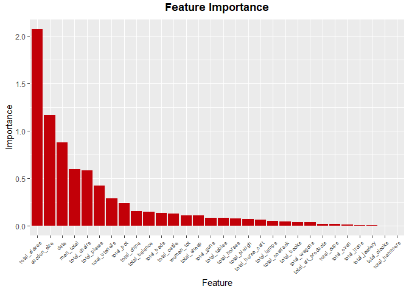
